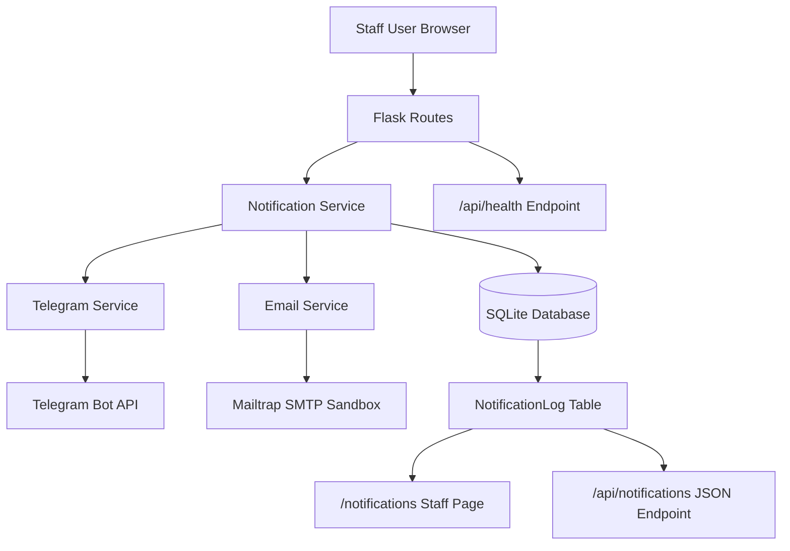
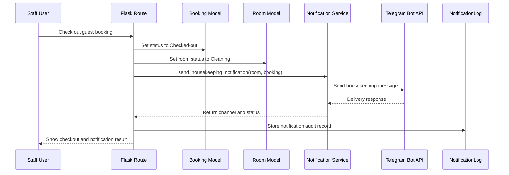
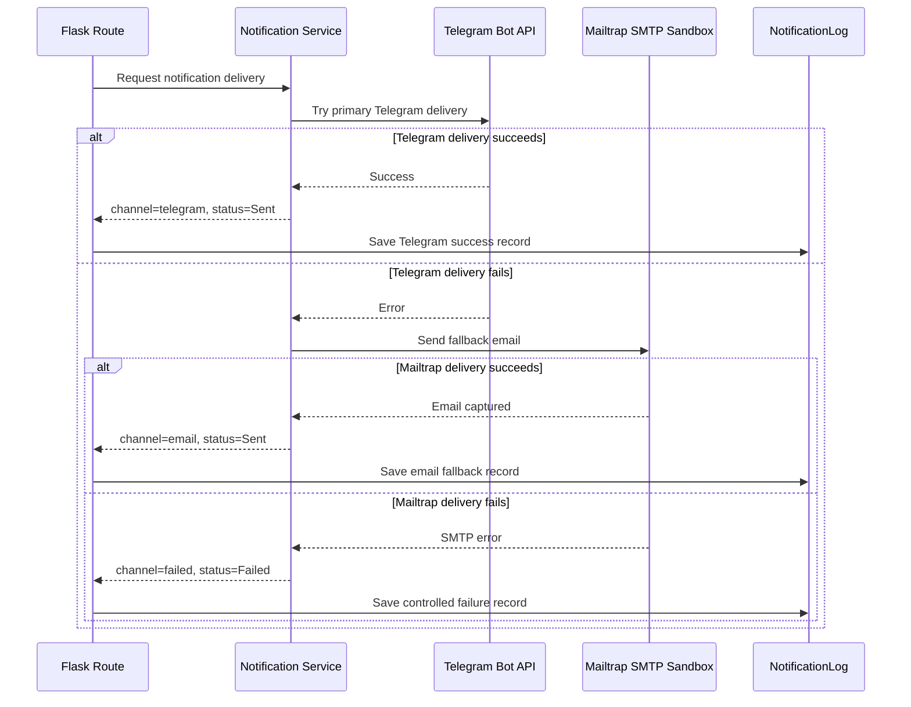
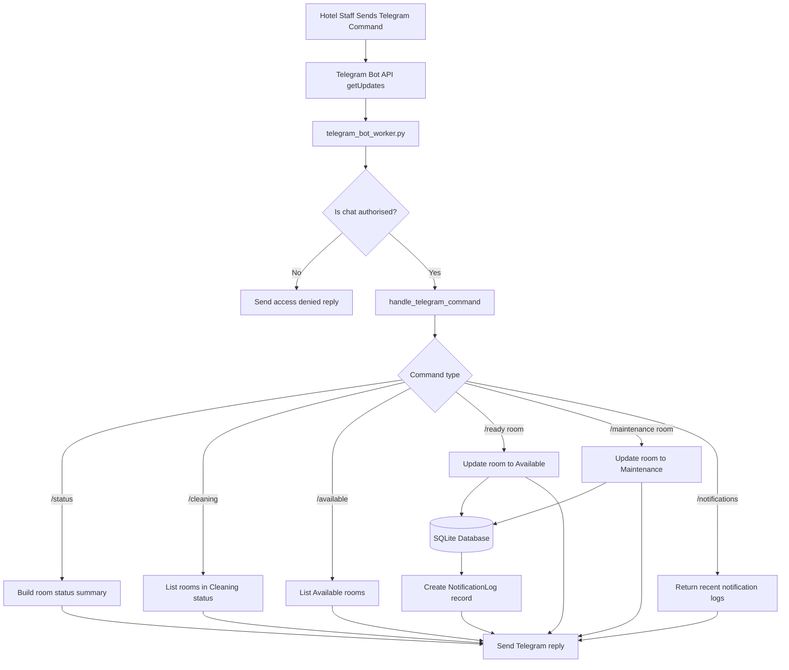
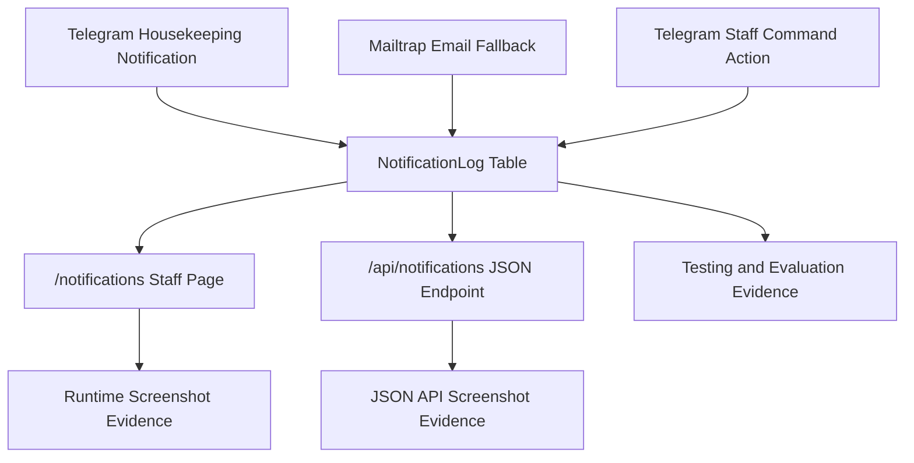

# API Design Diagrams

## Project

Boutique Hotel Booking and Room Management System

## Unit Focus

Unit 37: API Integration and External Service Communication

## Purpose

This document provides API-specific design evidence for the notification extension added to the Boutique Hotel Booking and Room Management System. It focuses on the integration between the Flask application, Telegram Bot API, Mailtrap SMTP Sandbox, the local database and the JSON audit endpoints.

The diagrams are kept separate from the original application design diagrams because the original design document supports the core booking system, while this document supports the API integration unit. This separation makes the evidence clearer and avoids mixing general application design with API-specific implementation evidence.

---

## 1. API Integration Architecture Diagram

This diagram shows the overall API integration architecture. The Flask application acts as the central controller. It receives staff actions from the browser, calls the notification service, sends external messages through Telegram or Mailtrap and stores delivery outcomes in the `NotificationLog` table.

### Explanation

The API notification extension uses a layered design. Flask routes handle booking and room status events, while the notification service coordinates external delivery. Telegram is used as the primary communication channel and Mailtrap SMTP Sandbox is used as the fallback email channel. All delivery outcomes are stored in `NotificationLog` and exposed through staff and JSON API views.

---

## 2. Guest Check-out to Telegram Notification Sequence

This sequence shows the main one-way notification workflow. When a checked-in guest is checked out, the booking status changes to `Checked-out`, the room status changes to `Cleaning`, and the system sends a housekeeping notification through Telegram.

### Explanation

This diagram supports the implemented check-out workflow. It shows that the external API call is triggered by a real business event rather than being an isolated test. It also shows that the delivery result is stored as audit evidence.

---

## 3. Telegram Primary Delivery and Mailtrap Email Fallback Sequence

This sequence shows the fallback logic. Telegram is attempted first. If Telegram delivery fails, the system sends the same data-minimised message through Mailtrap SMTP Sandbox. If both channels fail, the system records a controlled failure rather than crashing the booking workflow.

### Explanation

This diagram is important for the API unit because it shows resilience and controlled error handling. The system does not depend on a single external API. It attempts Telegram first, falls back to Mailtrap email and records the final outcome in the database.

---

## 4. Telegram Staff Command Bot Workflow

This workflow shows the two-way Telegram integration. Staff can send commands such as `/status`, `/cleaning`, `/ready 103`, `/maintenance 101` and `/notifications`. The bot worker receives Telegram updates, checks whether the chat is authorised, processes the command and sends a reply.

### Explanation

This diagram shows that the Telegram integration is not only one-way. The staff command bot allows authorised Telegram users to query operational information and update room status. Command actions are also stored in the audit log using the `telegram-command` channel.

---

## 5. NotificationLog and JSON API Audit Data Flow

This diagram shows how notification outcomes are stored and exposed as evidence. Telegram delivery, email fallback and Telegram command actions all create records in the `NotificationLog` table. These records are then available through the staff page and JSON API endpoint.

### Explanation

The audit data flow supports testing and evaluation. Instead of relying only on browser messages or terminal output, the implementation stores notification outcomes in the database and exposes them through both a human-readable staff page and a JSON API endpoint.

---

## API Diagram Summary

These diagrams show the API-specific design of the implemented extension:

- Telegram is used as the primary notification API.
- Mailtrap SMTP Sandbox is used as the fallback email service.
- Telegram staff commands provide two-way API interaction.
- `NotificationLog` stores delivery and command audit evidence.
- `/api/notifications` exposes notification records as JSON.
- `/api/health` confirms service availability.

This document should be used as Unit 37 API design evidence, while the original `design-diagrams.md` file should remain as Unit 36 application design evidence.
