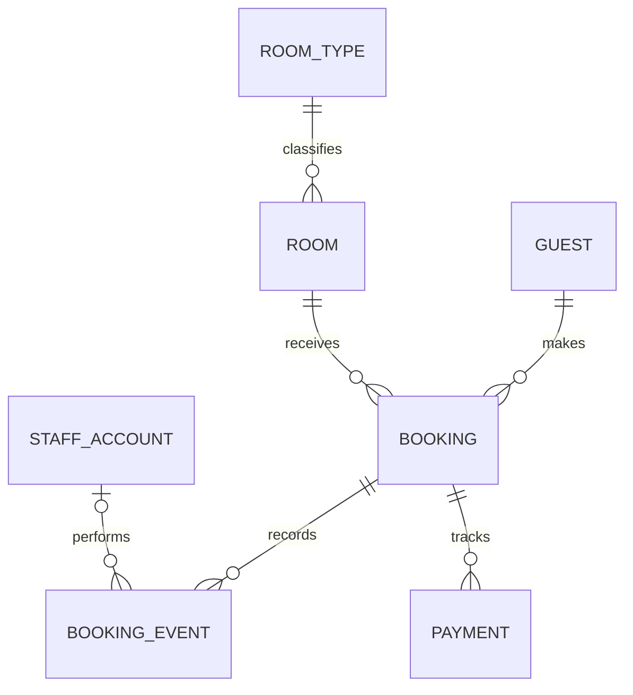

# Operational Domain Model

Phase 3 replaces the remaining academic-only storage assumptions with a
property-oriented model while preserving legacy rows through an additive
Alembic migration.

## Entity relationships

`RoomType` stores configurable commercial labels and stable physical features.
`Room` represents one physical room. Its operational state can be `ready`,
`cleaning` or `maintenance`. Physical occupancy is derived from a checked-in
booking and is not persisted on the room.

Booking prices and room rates use `NUMERIC(12, 2)` with an explicit three-letter
currency. A booking snapshots its total and currency when created or reassigned.
Payment records have their own amount, currency and state; changing a payment
does not change the booking lifecycle.

## Inventory contracts

The production seed uses stable type codes and configurable labels and rates:

| Physical rooms | Stable type code | Bathroom | Balcony/terrace |
|---|---|---|---|
| 1, 2, 6, 7 | `private-bathroom` | Private | No |
| 3 | `private-bathroom-terrace` | Private | Yes |
| 4, 5 | `shared-bathroom-economy` | Shared | No |

Rates have no source-code defaults. The production seed aborts until all three
rates are provided in runtime configuration. The separate academic demo seed
uses synthetic rooms and GBP values for local historical demonstrations.

## Booking history and external identity

Booking sources are `direct`, `phone`, `walk_in`, `booking_com` and `other`.
Provider and external reservation reference must either both be absent or both
be present. Their pair is unique and provides the idempotency boundary for a
future provider adapter without claiming any active provider integration.

Every service-managed booking creates append-only history. Supported event
types cover creation, modification, confirmation, rejection, cancellation,
room reassignment, check-in and check-out. The migration creates one
`legacy_migrated` event for each booking that predates this model. ORM guards
and migration-installed database triggers reject event updates and deletions.

## Legacy preservation

Migration `20260916_0003` creates one legacy room type for every distinct
historical room-type label, links existing rooms to it, maps historical
Cleaning and Maintenance states, and maps Available or Occupied to operational
`ready`. A checked-in booking remains the authoritative evidence of occupancy.

Historical floating-point prices are converted to two-decimal numeric values.
Their currency is set to GBP because the preserved academic interface displayed
pounds. Existing bookings use source `other`; external references remain empty.
Guest email and phone values are retained, while both columns become nullable
for new Phone and Walk-in records.
