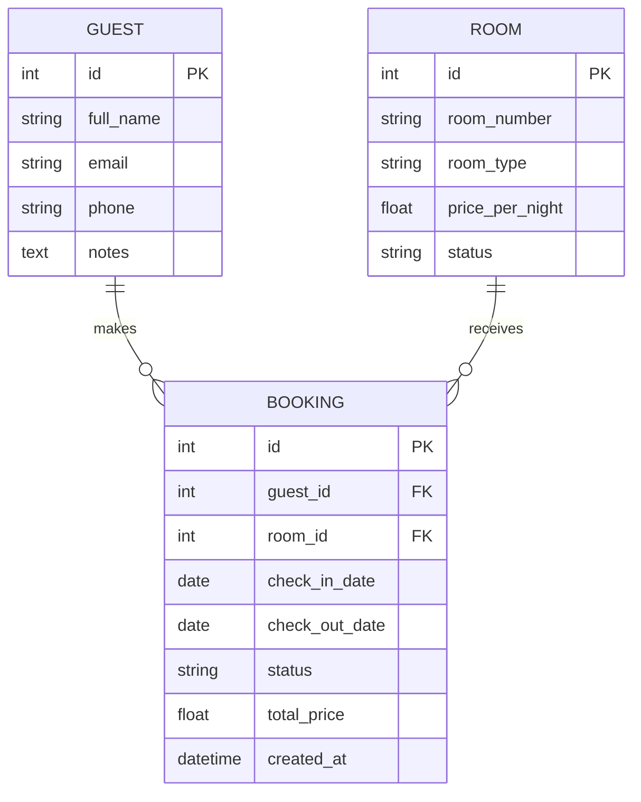
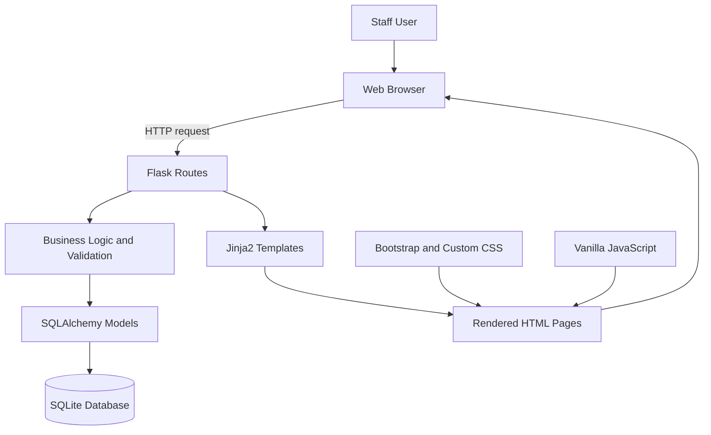
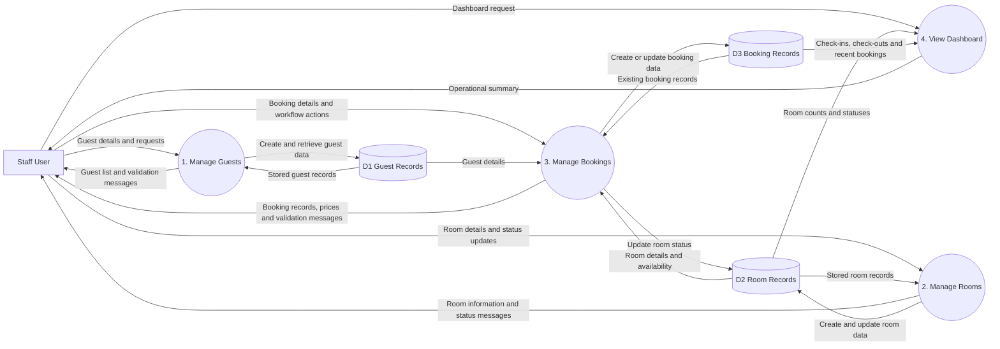
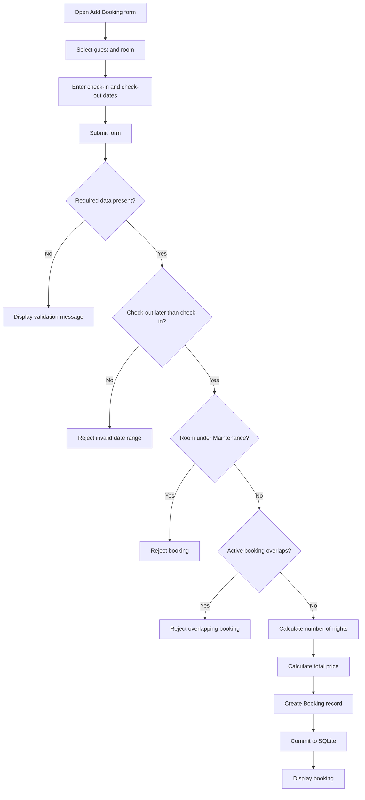
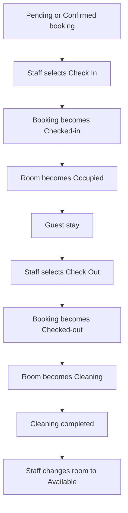
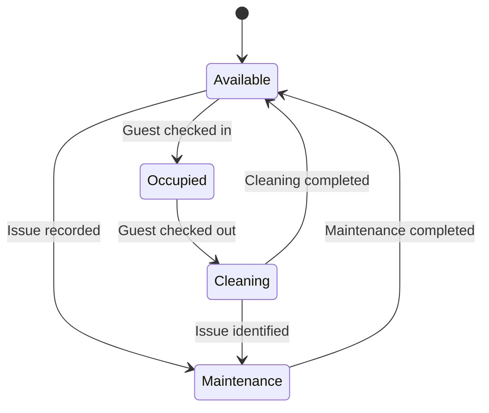
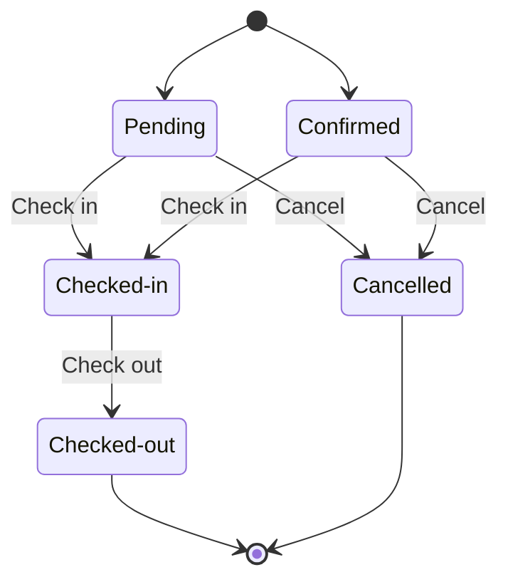
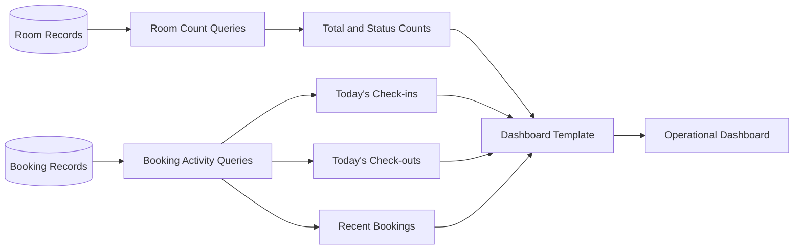

# Design Diagrams

This document presents the design of the Boutique Hotel Booking and Room Management System developed for the Application Development module.

It covers the relational data model, application architecture, data flows, booking workflows, use cases, page structure and links between the design, requirements and testing.

The later housekeeping notification extension is documented separately in the Application Program Interfaces documentation.

---

## 1. Entity Relationship Diagram

The core system contains three related entities:

- Guest;
- Room;
- Booking.

A guest can make multiple bookings over time. A room can also be associated with multiple bookings over time. Each booking connects one guest with one room for a defined stay period.

### Design rationale

The relational model avoids unnecessary data duplication.

- `Guest` stores guest contact information.
- `Room` stores room details, nightly price and operational status.
- `Booking` connects one guest and one room for a specified date range.

The model supports:

- guest and room management;
- booking creation;
- booking-price calculation;
- overlap prevention;
- Maintenance-room restrictions;
- check-in and check-out;
- booking and room-status tracking.

---

## 2. System Architecture

The application uses a server-rendered Flask architecture.

### Architecture components

| Component | Responsibility |
|---|---|
| Web browser | Displays pages and submits staff actions |
| Flask routes | Receive requests and coordinate application workflows |
| Business logic | Applies booking validation and status-transition rules |
| SQLAlchemy models | Represent Guest, Room and Booking records |
| SQLite | Stores local application data |
| Jinja2 templates | Generate server-rendered HTML pages |
| Bootstrap and custom CSS | Provide layout and visual presentation |
| Vanilla JavaScript | Supports filtering, date validation and cancellation confirmation |

Server-side validation remains authoritative because browser-side controls can be bypassed.

---

## 3. Data Flow Diagram

The Data Flow Diagram shows how information moves between the staff user, application processes and the three principal data stores.

### Data-flow explanation

- Guest details are validated and stored in the Guest data store.
- Room details and operational statuses are stored in the Room data store.
- Booking creation reads Guest, Room and existing Booking data before creating a new booking.
- Check-in and check-out update both Booking and Room records.
- The dashboard reads Room and Booking data to produce operational summaries.

---

## 4. Booking Creation and Validation Workflow

The workflow checks:

- required booking information;
- check-in and check-out date order;
- room Maintenance status;
- overlapping active bookings.

A booking is stored only after all validation rules pass.

---

## 5. Check-In and Check-Out Workflow

This workflow keeps booking and room records operationally consistent.

- Check-in changes the booking to `Checked-in` and the room to `Occupied`.
- Check-out changes the booking to `Checked-out` and the room to `Cleaning`.
- The room returns to `Available` only after cleaning has been completed.

---

## 6. Use Case UC-01: Check In

| Field | Description |
|---|---|
| Use case ID | UC-01 |
| Use case name | Check In Guest |
| Primary actor | Hotel staff member |
| Goal | Record the guest’s arrival and mark the assigned room as occupied |
| Preconditions | The booking exists and has Pending or Confirmed status |
| Trigger | Staff selects the Check In action |
| Related requirements | UR5, SR11 |
| Related test | TC12 |

### Main flow

1. Staff opens the Bookings page.
2. Staff identifies an eligible Pending or Confirmed booking.
3. Staff selects Check In.
4. The system checks that the booking is eligible for check-in.
5. The booking status changes to `Checked-in`.
6. The associated room status changes to `Occupied`.
7. The updated booking is displayed.

### Alternative flow

If the booking is not eligible for check-in, the system rejects the action and leaves the booking and room records unchanged.

### Postconditions

- The booking is recorded as an active stay.
- The room is recorded as occupied.
- The room is not treated as ready for another guest.

---

## 7. Use Case UC-02: Check Out

| Field | Description |
|---|---|
| Use case ID | UC-02 |
| Use case name | Check Out Guest |
| Primary actor | Hotel staff member |
| Goal | Complete the guest’s stay and move the room into the cleaning workflow |
| Preconditions | The booking exists and has Checked-in status |
| Trigger | Staff selects the Check Out action |
| Related requirements | UR5, SR11 |
| Related test | TC13 |

### Main flow

1. Staff opens the Bookings page.
2. Staff identifies a Checked-in booking.
3. Staff selects Check Out.
4. The system checks that the booking is eligible for check-out.
5. The booking status changes to `Checked-out`.
6. The associated room status changes to `Cleaning`.
7. The updated booking and room status are displayed.

### Alternative flow

If the booking is not currently Checked-in, the system rejects the action and leaves the records unchanged.

### Postconditions

- The guest stay is recorded as completed.
- The room is marked as requiring cleaning.
- The room is not returned directly to `Available`.

---

## 8. Room Status Lifecycle

| Status | Meaning |
|---|---|
| Available | The room is operationally ready for use |
| Occupied | A checked-in guest is using the room |
| Cleaning | The previous guest has checked out and preparation is required |
| Maintenance | The room has an operational issue and cannot be booked |

---

## 9. Booking Status Lifecycle

`Pending` and `Confirmed` are active pre-arrival states. `Checked-in` represents an active stay. `Checked-out` and `Cancelled` represent inactive or completed bookings.

The diagram does not claim that the MVP contains a separate action for changing a Pending booking to Confirmed.

---

## 10. Dashboard Information Flow

The dashboard gives staff a concise view of current hotel activity without requiring them to inspect every individual record.

---

## 11. Page Plan

| Page | Main Template | Purpose | Main Components |
|---|---|---|---|
| Dashboard | `templates/dashboard.html` | Provide an overview of current hotel activity | Room-status counts, today’s check-ins, today’s check-outs and recent bookings |
| Rooms | `templates/rooms.html` | Display and manage room records | Room table, status badges, status controls and filtering |
| Add Room | `templates/add_room.html` | Create a new room record | Room number, room type, nightly price and status fields |
| Guests | `templates/guests.html` | Display guest records | Guest table containing contact details and notes |
| Add Guest | `templates/add_guest.html` | Create a new guest record | Full name, email, phone and notes fields |
| Bookings | `templates/bookings.html` | Display and manage booking records | Booking table, statuses, prices, filters and workflow actions |
| Add Booking | `templates/add_booking.html` | Create a validated booking | Guest and room selectors, dates, booking status and validation messages |

The notification page and external messaging workflows belong to the later Application Program Interfaces extension and are not part of this core page plan.

---

## 12. Brief Test Plan

The detailed testing strategy is recorded in `docs/testing-plan.md`. Actual outcomes are recorded in `docs/test-results-template.md`.

| Design Area | Main Verification | Related Tests |
|---|---|---|
| Dashboard | Verify summary information and displayed counts | TC01, TC18 |
| Guest management | Verify valid creation, invalid email and duplicate prevention | TC03–TC05 |
| Room management | Verify room display, creation and status updates | TC02, TC06, TC14 |
| Booking workflow | Verify booking creation, total price and cancellation | TC07, TC17 |
| Date validation | Reject missing or invalid booking dates | TC08, TC11 |
| Availability protection | Reject overlapping bookings and Maintenance rooms | TC09, TC10 |
| Check-in use case | Update booking and room statuses correctly | TC12 |
| Check-out use case | Update booking and room statuses correctly | TC13 |
| Frontend filtering | Filter rooms and bookings by status | TC15, TC16 |
| Usability and responsiveness | Verify navigation and reduced-width layout | TC19 |
| Regression protection | Run the complete automated pytest suite | Complete pytest regression suite |

Testing combines manual workflow testing, negative validation testing and automated regression testing.

---

## 13. Design Traceability

| Design Element | Related Requirements | Related Tests |
|---|---|---|
| Entity Relationship Diagram | UR1–UR7, SR2, SR3, SR6 | TC02, TC03, TC06, TC07 |
| System Architecture | SR1–SR5, SR12, NFR2, NFR4 | TC01–TC19 and the complete pytest regression suite |
| Data Flow Diagram | UR1–UR7, SR6–SR11 | TC01–TC18 |
| Booking Creation Workflow | UR4, UR9, SR7–SR10 | TC07–TC11 |
| UC-01 Check In | UR5, SR11 | TC12 |
| UC-02 Check Out | UR5, SR11 | TC13 |
| Room Status Lifecycle | UR3, UR5, UR6, SR10, SR11 | TC10, TC12–TC14 |
| Booking Status Lifecycle | UR4, UR5, SR9, SR11 | TC09, TC12, TC13, TC17 |
| Dashboard Information Flow | UR6, UR7 | TC01, TC18 |
| Page Plan | UR1–UR8, NFR1 | TC01–TC19 |
| Brief Test Plan | All implemented requirements | TC01–TC19 and the complete pytest regression suite |

---

## 14. Key Design Decisions

### Flask and server-rendered pages

Flask was selected because it supports rapid development of a small internal application without requiring a separate frontend framework.

### Relational database

Guest, Room and Booking records have clear relationships, making a relational database appropriate.

### SQLite

SQLite is proportionate to a local academic MVP. A production multi-user system could migrate to PostgreSQL or another server-based relational database.

### Server-side validation

Important business rules are enforced on the server. JavaScript improves usability but is not treated as the only validation layer.

### Scope separation

The housekeeping notification and external API functionality are documented separately so that the Application Development design remains clear and traceable.

---

## Design Summary

The design provides:

- a relational Guest, Room and Booking model;
- a lightweight Flask architecture;
- clearly defined data flows;
- booking validation and price calculation;
- coordinated check-in and check-out use cases;
- controlled room and booking-status transitions;
- a structured page plan;
- links between design, requirements and testing.

The design is appropriate for a local academic MVP. Authentication, role-based permissions, guest editing, online payments, cloud deployment and advanced reporting remain suitable future improvements.