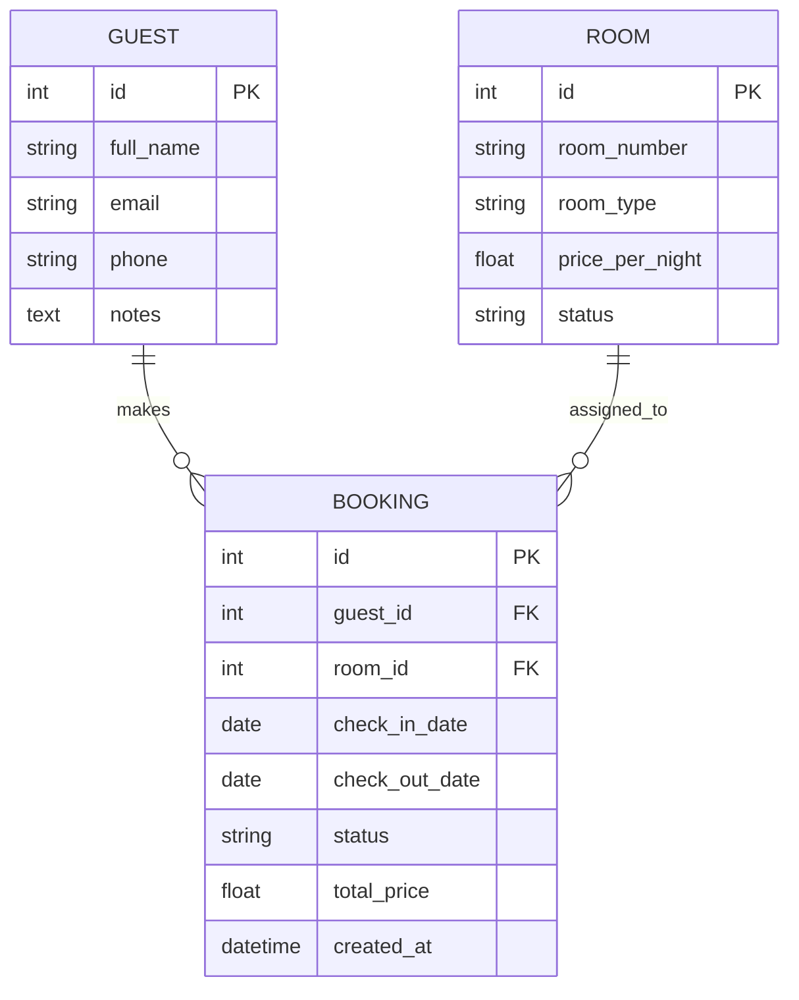
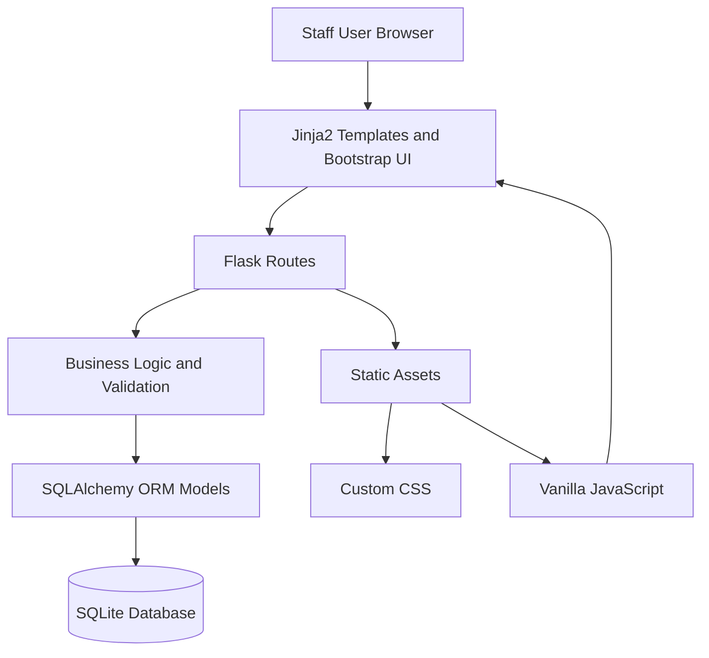
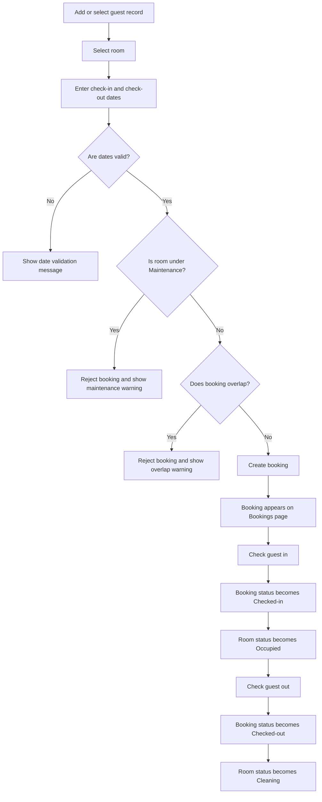
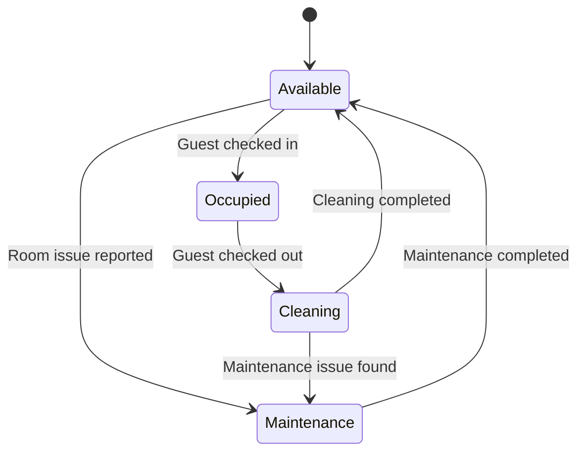
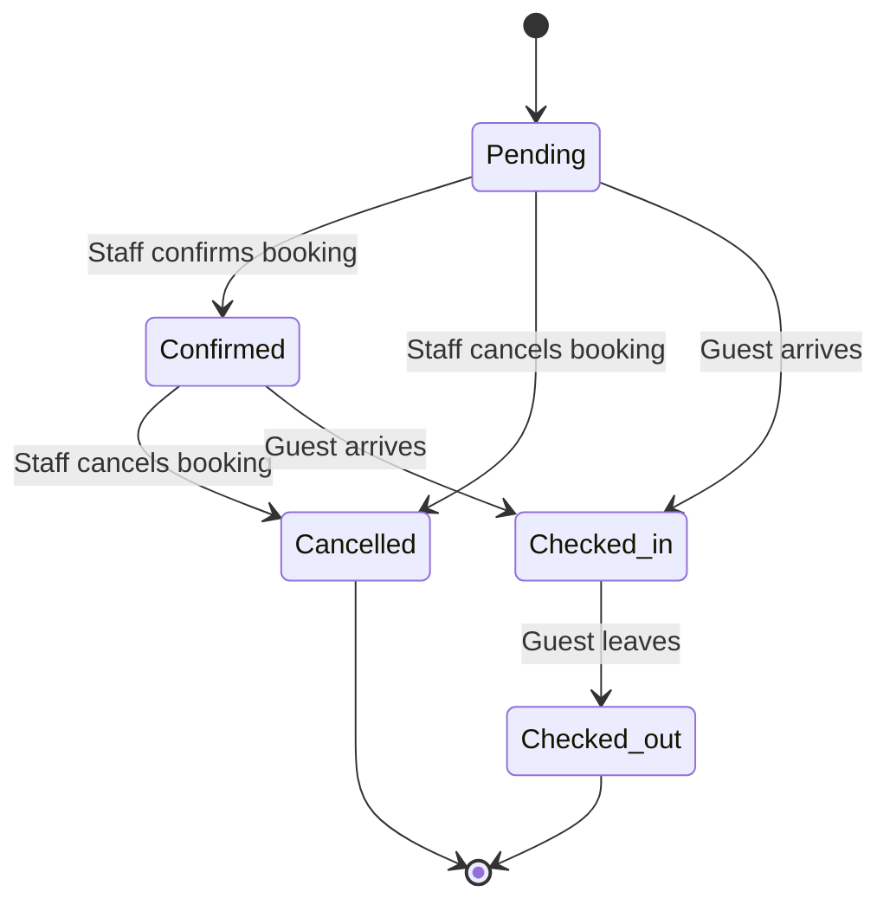

# Design Diagrams

## Project
Boutique Hotel Booking and Room Management System

## Purpose
This document provides design evidence for the Boutique Hotel Booking and Room Management System. It explains the core database structure, the system architecture, and the main staff workflow used to create and manage bookings.

The diagrams support the design stage of the project by showing how the application was planned before and during implementation. They also help connect the final codebase with the requirements, testing evidence and evaluation.

---

## 1. Entity Relationship Diagram

The Entity Relationship Diagram shows the core data model used by the application. The system has three main entities: `Guest`, `Room` and `Booking`.

A guest can have many bookings. A room can also have many bookings over time. Each booking connects one guest with one room for a specific date range.

### ERD Explanation

The application uses a simple relational model that matches the operational workflow of a small boutique hotel.

- `Guest` stores guest contact information such as full name, email, phone number and notes.
- `Room` stores room information such as room number, room type, price per night and current room status.
- `Booking` stores the relationship between one guest and one room for a specific stay period.

The `Booking` table contains foreign keys for `guest_id` and `room_id`. This allows the application to display booking information together with guest and room details. It also supports validation logic, such as checking whether a room already has an active booking during the selected date range.

This structure is suitable for the current MVP because it is simple, understandable, and directly supports the main user workflows: adding guests, managing rooms, creating bookings, preventing double bookings, and updating booking status during check-in and check-out.

---

## 2. System Architecture Diagram

The system architecture diagram shows how the main application layers interact when staff use the system through a browser.

### Architecture Explanation

The system follows a lightweight server-rendered web application architecture.

1. Staff access the application through a local browser at `http://127.0.0.1:5000`.
2. Flask routes receive requests from the browser and return rendered HTML pages.
3. Jinja2 templates generate the user interface for dashboard, rooms, guests and bookings.
4. Bootstrap and custom CSS provide the responsive staff-facing interface.
5. Vanilla JavaScript adds lightweight frontend behaviour, including room filtering, booking filtering, date validation and cancellation confirmation.
6. Flask route logic applies business validation, including invalid date checks, maintenance-room restrictions and overlapping booking prevention.
7. SQLAlchemy models manage communication between the Flask application and the SQLite database.
8. SQLite stores the local application data for guests, rooms and bookings.

This architecture is appropriate for a small internal hotel operations prototype because it is easy to run locally, easy to explain, and suitable for manual testing. It also keeps the implementation understandable while still demonstrating real application development principles.

---

## 3. Main Booking Workflow Diagram

The workflow diagram shows the typical staff process for creating and managing a booking.

### Workflow Explanation

This workflow demonstrates how the system supports staff during the booking lifecycle.

The staff member first selects or creates a guest record, selects a room, and enters a check-in and check-out date. The system then applies several validation rules before saving the booking.

The system checks that:

- the check-out date is after the check-in date;
- the selected room is not under Maintenance;
- the selected room does not already have an active overlapping booking.

If validation fails, the system rejects the booking and displays a clear message. If validation passes, the booking is created and appears on the Bookings page.

When the guest arrives, staff can check the booking in. This changes the booking status to `Checked-in` and the room status to `Occupied`. When the guest leaves, staff can check the booking out. This changes the booking status to `Checked-out` and moves the room into the `Cleaning` status.

---

## 4. Room Status Lifecycle Diagram

The room status lifecycle diagram shows how a room can move through different operational states.

### Room Status Explanation

The room status lifecycle supports reception and housekeeping coordination.

- `Available` means the room can be booked.
- `Occupied` means the guest has checked in and the room is in use.
- `Cleaning` means the guest has checked out and the room needs housekeeping before it can be reused.
- `Maintenance` means the room has an issue and cannot be booked until the issue is resolved.

This lifecycle helps prevent operational mistakes, such as booking a room that is not ready or assigning a room that is under maintenance.

---

## 5. Booking Status Lifecycle Diagram

The booking status lifecycle diagram shows how a booking moves through the system from creation to completion or cancellation.

### Booking Status Explanation

The booking status lifecycle supports the main front desk workflow.

- `Pending` represents a booking that has been created but not yet fully confirmed.
- `Confirmed` represents a booking that is ready for arrival.
- `Checked-in` represents an active stay.
- `Checked-out` represents a completed stay.
- `Cancelled` represents a booking that is no longer active.

The system treats `Pending`, `Confirmed` and `Checked-in` bookings as active for overlap validation. This prevents the same room from being assigned to another active booking during the same date range.

---

## Design Summary

The diagrams show that the application has a clear relational data model, a simple maintainable architecture and a logical operational workflow.

The design supports the main business needs of a small boutique hotel:

- managing guest records;
- managing room records and room readiness;
- creating and validating bookings;
- preventing double bookings;
- preventing maintenance rooms from being booked;
- supporting check-in and check-out workflows;
- providing operational visibility through the dashboard.

The design is intentionally lightweight and suitable for an MVP. Future improvements could include authentication, role-based permissions, guest editing, cloud deployment, email confirmations, payment integration and advanced reporting.